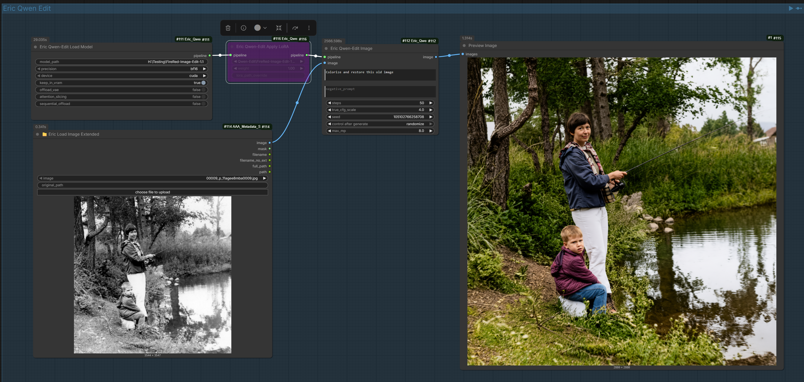
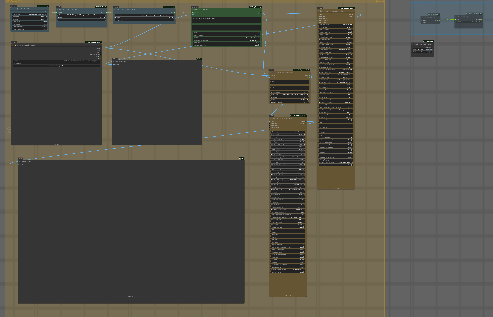

# Eric Qwen-Edit & Qwen-Image Nodes

ComfyUI custom nodes for **Qwen-Image-Edit-2511** (image editing) and **Qwen-Image-2512** (text-to-image generation) — 20-billion-parameter MMDiT models by Qwen (Alibaba).  
17 nodes covering loading, single-image editing, multi-image fusion, style transfer, inpainting, inpaint-with-transfer, LoRA, Spectrum acceleration, delta overlay, mask utilities, and **text-to-image generation**.


*Edit images at full 8 MP resolution — just a loader, LoRA, and edit node.*

## Features

- **Text-to-image generation** — Generate images from text prompts using Qwen-Image-2512
- **Preserves input resolution** — No forced upscaling to fill a pixel budget (edit nodes)
- **Configurable max_mp cap** — Control maximum output size for VRAM safety
- **Resolution presets** — Quick selection of common aspect ratios for generation
- **VAE tiling** — Automatic high-resolution decode without OOM
- **Supports up to 16 MP** — Edit or generate large images directly
- **True CFG** — Two full transformer forward passes per step (conditional + unconditional)
- **Dual conditioning paths** — VL path (~384 px semantic tokens via Qwen2.5-VL) + VAE/ref path (output-resolution pixel latents), individually controllable per image (edit nodes)
- **Spectrum acceleration** — Training-free CVPR 2026 Chebyshev feature forecaster for ~3–5× speedup (both edit and generation)
- **Progress bars** — Native ComfyUI progress display during denoising on every generation/edit node

## Why Use This?

The default Qwen-Image-Edit pipeline in diffusers forces all outputs to ~1 MP (1024×1024), regardless of input size. This means:

- A 12 MP photo gets reduced to 1 MP
- Fine details are lost
- You can't edit high-resolution images directly

These nodes use a custom pipeline that:

1. **Preserves input resolution** when smaller than max_mp
2. **Scales down proportionally** when input exceeds max_mp
3. **Aligns to 32 pixels** as required by the model

### Example

| Input | Default Pipeline | Eric Qwen-Edit (max_mp=16) |
|-------|------------------|----------------------------|
| 2 MP  | 1 MP output      | 2 MP output                |
| 6 MP  | 1 MP output      | 6 MP output                |
| 20 MP | 1 MP output      | 16 MP output (capped)      |

### Automatic Sigma Scheduling (No "Aura Flow Shift" Needed)

Many Qwen-Image workflows in ComfyUI use a **ModelSamplingAuraFlow** (or "Aura Flow Shift") node in the model path. That node exists because ComfyUI's native UNET → KSampler approach treats the model, scheduler, and sampler as separate graph nodes — users have to manually configure the **sigma time-shift** that flow-matching models need to produce good results. Without it the sigma schedule is unshifted and the model produces washed-out or burned images.

These nodes use the **Hugging Face diffusers pipeline** directly, which handles sigma scheduling automatically:

| Aspect | ComfyUI native (UNET + KSampler) | Eric Qwen-Edit / Qwen-Image (diffusers) |
|--------|-----------------------------------|------------------------------------------|
| Sigma shifting | Manual — requires an extra "Aura Flow Shift" node with a user-chosen shift value | Automatic — `FlowMatchEulerDiscreteScheduler` with `use_dynamic_shifting` reads the correct parameters from the model config |
| Resolution-aware | No — fixed shift regardless of output size | Yes — time-shift mu is interpolated from the output resolution's latent sequence length |
| Shift formula | `α·t / (1 + (α-1)·t)` with a single hand-tuned α | Exponential: `exp(μ) / (exp(μ) + (1/t - 1))` + terminal stretch, where μ adapts per resolution |
| Configuration | User must wire the node and pick values | Zero-config — parameters come from `scheduler_config.json` shipped with the model |

In short, the diffusers scheduler already performs a more sophisticated, resolution-adaptive version of what the Aura Flow Shift node does manually. **You do not need any extra shift nodes with these nodes.**

## Installation

### Option 1: ComfyUI Manager

Search for "Eric Qwen-Edit" in ComfyUI Manager.

### Option 2: Manual

```bash
cd ComfyUI/custom_nodes
git clone https://github.com/EricRollei/Eric_Qwen_Edit_Experiments.git
```

## Requirements

- **Edit Model**: Download Qwen-Image-Edit-2511 (recommended) or 2509
  - https://huggingface.co/Qwen/Qwen-Image-Edit-2511
- **Generation Model**: Download Qwen-Image-2512 (recommended) or Qwen-Image
  - https://huggingface.co/Qwen/Qwen-Image-2512
  - https://huggingface.co/Qwen/Qwen-Image
- **VRAM**:
  - 24 GB for up to 2 MP
  - 48 GB for up to 6 MP
  - 96 GB for up to 16 MP

---

## Nodes

### Eric Qwen-Edit Load Model

Loads the Qwen-Image-Edit pipeline from a local directory.

| Parameter | Type | Default | Description |
|-----------|------|---------|-------------|
| `model_path` | STRING | — | Path to the Qwen-Image-Edit model directory |
| `precision` | COMBO | `bf16` | Weight precision: bf16 (recommended), fp16, fp32 |
| `device` | COMBO | `cuda` | Device: cuda, cuda:0, cuda:1, cpu |
| `keep_in_vram` | BOOLEAN | `True` | Cache pipeline between runs to avoid reload |
| `offload_vae` | BOOLEAN | `False` | Move VAE to CPU when not in use (saves ~1 GB) |
| `attention_slicing` | BOOLEAN | `False` | Trade speed for lower peak VRAM |
| `sequential_offload` | BOOLEAN | `False` | Extreme VRAM savings via sequential CPU offload |

**Output:** `QWEN_EDIT_PIPELINE`

---

### Eric Qwen-Edit Component Loader

Advanced loader that lets you swap individual sub-models (transformer, VAE, or text encoder) from different directories. Useful for testing fine-tuned components without duplicating the full ~54 GB model.

> **Important — architecture constraints:** Every component must be architecture-compatible with Qwen-Image-Edit. The text encoder is **Qwen2.5-VL** (`Qwen2_5_VLForConditionalGeneration`), **not** CLIP. You cannot plug in a Stable Diffusion UNet, a standard CLIP model, or an unrelated VAE. You *can* use different fine-tuned or quantised versions of the same Qwen-Image-Edit components.

> **`base_pipeline_path` is always required**, even if you override all three components. The base path provides the scheduler config, tokenizer, and processor files that have no separate override.

#### What the base path must contain

The minimum viable `base_pipeline_path` folder needs these files (the small config/tokenizer files, not the large weights):

```
base_pipeline_path/
├── model_index.json                 ← pipeline class mapping (required)
├── scheduler/
│   └── scheduler_config.json        ← FlowMatchEulerDiscreteScheduler config
├── tokenizer/
│   ├── vocab.json
│   ├── merges.txt
│   ├── tokenizer_config.json
│   ├── added_tokens.json
│   ├── special_tokens_map.json
│   └── chat_template.jinja
└── processor/
    ├── tokenizer.json
    ├── preprocessor_config.json
    ├── video_preprocessor_config.json
    ├── vocab.json
    ├── merges.txt
    ├── tokenizer_config.json
    ├── added_tokens.json
    ├── special_tokens_map.json
    └── chat_template.jinja
```

If you don't override a component, its weights are also loaded from the base path.

#### Component folder structures

Each override path must contain a `config.json` plus the weight files for that component:

**Transformer** (~38 GB, `QwenImageTransformer2DModel` — 20B-parameter MMDiT):
```
transformer_path/
├── config.json
├── diffusion_pytorch_model.safetensors.index.json
├── diffusion_pytorch_model-00001-of-00005.safetensors
├── diffusion_pytorch_model-00002-of-00005.safetensors
├── diffusion_pytorch_model-00003-of-00005.safetensors
├── diffusion_pytorch_model-00004-of-00005.safetensors
└── diffusion_pytorch_model-00005-of-00005.safetensors
```
Also accepts: a parent folder with a `transformer/` subfolder, or a single `.safetensors` file (loaded as state dict into the base architecture).

**VAE** (~0.24 GB, `AutoencoderKLQwenImage`):
```
vae_path/
├── config.json
└── diffusion_pytorch_model.safetensors
```
Also accepts a parent folder with a `vae/` subfolder.

**Text Encoder** (~15.5 GB, `Qwen2_5_VLForConditionalGeneration` — Qwen2.5-VL 7B):
```
text_encoder_path/
├── config.json
├── generation_config.json
├── model.safetensors.index.json
├── model-00001-of-00004.safetensors
├── model-00002-of-00004.safetensors
├── model-00003-of-00004.safetensors
└── model-00004-of-00004.safetensors
```
Also accepts a parent folder with a `text_encoder/` subfolder.

#### Typical use cases

| Scenario | What to set |
|----------|-------------|
| Fine-tuned transformer only | `base_pipeline_path` = full model, `transformer_path` = fine-tune dir |
| Quantised text encoder | `base_pipeline_path` = full model, `text_encoder_path` = quantised dir |
| Everything stock | Just use the standard **Load Model** node instead |

#### Node parameters

| Parameter | Type | Default | Description |
|-----------|------|---------|-------------|
| `base_pipeline_path` | STRING | — | Path to complete Qwen-Image-Edit model (always required — provides scheduler, tokenizer, processor, and defaults for unset components) |
| `transformer_path` | STRING | *(empty)* | Optional override — transformer weights directory or single `.safetensors` file |
| `vae_path` | STRING | *(empty)* | Optional override — VAE weights directory |
| `text_encoder_path` | STRING | *(empty)* | Optional override — text encoder weights directory |
| `precision` | COMBO | `bf16` | bf16, fp16, fp32 |
| `device` | COMBO | `cuda` | cuda, cuda:0, cuda:1, cpu |
| `keep_in_vram` | BOOLEAN | `True` | Cache between runs |
| `offload_vae` | BOOLEAN | `False` | Offload VAE to CPU when idle |
| `attention_slicing` | BOOLEAN | `False` | Attention slicing for lower VRAM |
| `sequential_offload` | BOOLEAN | `False` | Sequential CPU offload |

**Output:** `QWEN_EDIT_PIPELINE`

> **Note for ComfyUI users:** The standard ComfyUI "Load Diffusion Model" / "Load CLIP" / "Load VAE" nodes produce ComfyUI-internal model wrappers and **will not work** with these nodes. Qwen-Image-Edit requires the diffusers `from_pretrained` loading path, which is what both the Load Model and Component Loader nodes provide.

---

### Eric Qwen-Edit Unload

Free VRAM by unloading the pipeline. Connect after the last generation node.

| Parameter | Type | Default | Description |
|-----------|------|---------|-------------|
| `pipeline` | QWEN_EDIT_PIPELINE | *(optional)* | Pipeline to unload |
| `images` | IMAGE | *(optional)* | Passthrough — connect to trigger unload after generation |

**Output:** `status` (STRING)

---

### Eric Qwen-Edit Image

Edit a single image using a text prompt.

| Parameter | Type | Default | Description |
|-----------|------|---------|-------------|
| `pipeline` | QWEN_EDIT_PIPELINE | — | From any loader node |
| `image` | IMAGE | — | Image to edit |
| `prompt` | STRING | — | Describe the edit |
| `negative_prompt` | STRING | *(empty)* | What to avoid |
| `steps` | INT | `8` | Inference steps (8 for lightning LoRA, 50 for base model) |
| `true_cfg_scale` | FLOAT | `4.0` | True CFG strength (1.0–20.0) |
| `seed` | INT | `0` | Random seed |
| `max_mp` | FLOAT | `8.0` | Maximum output megapixels (0.5–16.0) |

**Output:** `IMAGE`

---

### Eric Qwen-Edit Inpaint

Inpaint masked regions of an image. The model has no native mask input — this node blanks the masked area, lets the model regenerate it, then composites the result back onto the original with feathered blending.

**Strategy:** blank masked region → model sees hole and prompt → post-composite with Gaussian-feathered mask.

| Parameter | Type | Default | Description |
|-----------|------|---------|-------------|
| `pipeline` | QWEN_EDIT_PIPELINE | — | From loader |
| `image` | IMAGE | — | Image to inpaint |
| `mask` | MASK | — | White = inpaint, black = keep |
| `prompt` | STRING | — | Describe what to generate in masked area |
| `mask_mode` | COMBO | `blank_white` | How to blank the mask: blank_white, blank_gray, color_overlay |
| `feather` | INT | `8` | Gaussian blur radius for mask edge blending |
| `negative_prompt` | STRING | *(empty)* | What to avoid |
| `steps` | INT | `8` | Inference steps |
| `true_cfg_scale` | FLOAT | `4.0` | True CFG strength |
| `seed` | INT | `0` | Random seed |
| `max_mp` | FLOAT | `8.0` | Maximum output megapixels |

**Output:** `IMAGE`

---

### Eric Qwen-Edit Inpaint Transfer

Transfer content from a reference image into the masked region of the original. Combines pre-compositing, model harmonisation, and post-compositing for seamless results.

**Strategy:**
1. Scale the transfer image (+ optional transfer mask) proportionally so the source region fits inside the target mask bounding box
2. Pre-composite the transfer into the masked area — model sees content already in place
3. Model harmonises lighting, color, and edges via the prompt
4. Post-composite with feathered mask to preserve the original outside the mask

| Parameter | Type | Default | Description |
|-----------|------|---------|-------------|
| `pipeline` | QWEN_EDIT_PIPELINE | — | From loader |
| `image` | IMAGE | — | Original image (target) |
| `mask` | MASK | — | Target region (white = where to place transfer) |
| `transfer_image` | IMAGE | — | Reference image containing the content to transfer |
| `prompt` | STRING | — | Describe what you want (e.g. "harmonise the pasted element with its surroundings") |
| `transfer_mask` | MASK | *(optional)* | Mark which part of the transfer image to use (white = keep). When provided, both masks' bounding boxes are used for proportional scaling. |
| `transfer_vl_ref` | BOOLEAN | `True` | Also send full transfer image as a VL semantic reference |
| `blend_strength` | FLOAT | `1.0` | Pre-composite alpha (0.0–1.0) |
| `feather` | INT | `8` | Gaussian blur radius for post-composite blending |
| `negative_prompt` | STRING | *(empty)* | What to avoid |
| `steps` | INT | `8` | Inference steps |
| `true_cfg_scale` | FLOAT | `4.0` | True CFG strength |
| `seed` | INT | `0` | Random seed |
| `max_mp` | FLOAT | `8.0` | Maximum output megapixels |

**Output:** `IMAGE`

---

### Eric Qwen-Edit Multi-Image Fusion

Combine 2–4 images with composition modes and per-image conditioning control over both the VL (semantic) and VAE/ref (pixel) paths.

| Parameter | Type | Default | Description |
|-----------|------|---------|-------------|
| `pipeline` | QWEN_EDIT_PIPELINE | — | From loader |
| `image_1` – `image_4` | IMAGE | — (2 required) | Input images (image_3, image_4 optional) |
| `prompt` | STRING | — | Describe the desired composition |
| `composition_mode` | COMBO | `group` | group / scene / merge / raw |
| `subject_label` | STRING | *(empty)* | Optional label for subject identification |
| `main_image` | COMBO | `image_1` | Which image seeds the output resolution and denoising |
| `vae_target_size` | INT | `0` | VAE encoding resolution for ref images (0 = match output) |
| `vl_1` – `vl_4` | BOOLEAN | `True` | Include each image in the VL semantic path |
| `ref_1` | BOOLEAN | `True` | Include image_1 in the VAE/ref pixel path |
| `ref_2` – `ref_4` | BOOLEAN | `False` | Include secondary images in VAE/ref path (default off — VL-only) |
| `negative_prompt` | STRING | *(empty)* | What to avoid |
| `steps` | INT | `8` | Inference steps |
| `true_cfg_scale` | FLOAT | `4.0` | True CFG strength |
| `seed` | INT | `0` | Random seed |
| `max_mp` | FLOAT | `8.0` | Maximum output megapixels |

**Output:** `IMAGE`

---

### Eric Qwen-Edit Style Transfer

Apply the visual style of one image to the content of another, with fine-grained control over which aspects of style are transferred.

| Parameter | Type | Default | Description |
|-----------|------|---------|-------------|
| `pipeline` | QWEN_EDIT_PIPELINE | — | From loader |
| `style_image` | IMAGE | — | Reference providing the aesthetic |
| `content_image` | IMAGE | — | Image to restyle |
| `style_mode` | COMBO | `full_style` | full_style / color_palette / lighting / artistic_medium / texture / custom |
| `custom_prompt` | STRING | *(empty)* | When non-empty, always overrides the style_mode template |
| `additional_guidance` | STRING | *(empty)* | Extra instructions appended to the auto-generated prompt |
| `style_strength` | FLOAT | `1.0` | Scales CFG for stronger/weaker style (0.1–3.0) |
| `vae_target_size` | INT | `1024` | VAE encoding resolution for style image |
| `vl_style` | BOOLEAN | `True` | Style image in VL semantic path |
| `vl_content` | BOOLEAN | `True` | Content image in VL semantic path |
| `ref_style` | BOOLEAN | `False` | Style image in VAE/ref pixel path (off by default — avoids pixel bleed) |
| `ref_content` | BOOLEAN | `True` | Content image in VAE/ref pixel path |
| `negative_prompt` | STRING | *(empty)* | What to avoid |
| `steps` | INT | `8` | Inference steps |
| `true_cfg_scale` | FLOAT | `4.0` | True CFG strength |
| `seed` | INT | `0` | Random seed |
| `max_mp` | FLOAT | `8.0` | Maximum output megapixels |

**Output:** `IMAGE`

---

### Eric Qwen-Edit Spectrum Accelerator

Training-free diffusion acceleration based on the **Spectrum** method (CVPR 2026). Uses Chebyshev polynomial feature forecasting to skip redundant transformer forward passes, achieving ~3–5× speedup with minimal quality loss.

Attach this node between the loader and any generation node. The config is stored on the pipeline and takes effect during the next denoising run. Automatically disabled when total steps < `min_steps`.

| Parameter | Type | Default | Description |
|-----------|------|---------|-------------|
| `pipeline` | QWEN_EDIT_PIPELINE | — | From loader |
| `enable` | BOOLEAN | `True` | Toggle acceleration on/off |
| `warmup_steps` | INT | `3` | Full-compute warm-up steps before forecasting begins |
| `window_size` | INT | `2` | History window for Chebyshev polynomial fitting |
| `flex_window` | FLOAT | `0.75` | Fraction of remaining steps to recompute vs. forecast (0.0–1.0) |
| `w` | FLOAT | `0.5` | Blend weight between forecast and previous features |
| `lam` | FLOAT | `0.1` | Regularisation coefficient for the forecaster |
| `M` | INT | `4` | Chebyshev polynomial degree |
| `min_steps` | INT | `15` | Spectrum auto-disables below this step count |

**Output:** `QWEN_EDIT_PIPELINE` (same pipeline with spectrum config attached)

---

### Eric Qwen-Edit LoRA

Load a LoRA adapter into the pipeline. Use the lightning LoRA for 8-step inference.

| Parameter | Type | Default | Description |
|-----------|------|---------|-------------|
| `pipeline` | QWEN_EDIT_PIPELINE | — | From loader |
| `lora_name` | COMBO | — | Dropdown of `.safetensors` files in `ComfyUI/models/loras/` |
| `weight` | FLOAT | `1.0` | LoRA scale (0.0–2.0) |
| `lora_path_override` | STRING | *(empty, optional)* | Full path to a LoRA file outside the standard loras folder |

**Output:** `QWEN_EDIT_PIPELINE`

---

### Eric Qwen-Edit Unload LoRA

Remove all LoRA adapters from the pipeline, restoring base weights.

| Parameter | Type | Default | Description |
|-----------|------|---------|-------------|
| `pipeline` | QWEN_EDIT_PIPELINE | — | Pipeline with LoRA loaded |

**Output:** `QWEN_EDIT_PIPELINE`

---

### Eric Qwen-Edit Delta Overlay

Compare an edited image with the original, extract a change mask, and composite the edit onto the original only where changes occurred. Useful for upscaling an edit at full resolution and applying it precisely.

| Parameter | Type | Default | Description |
|-----------|------|---------|-------------|
| `original_image` | IMAGE | — | Original (before edit) |
| `edited_image` | IMAGE | — | Edited (after edit) — may be a different resolution |
| `threshold` | FLOAT | `0.05` | Minimum per-pixel difference to count as a change (0.0–1.0) |
| `blur_radius` | INT | `5` | Gaussian blur on the change mask for softer edges |
| `expand_mask` | INT | `3` | Dilate the mask by this many pixels |
| `upscale_method` | COMBO | `lanczos` | Resampling method when resizing: lanczos, bicubic, bilinear, nearest |
| `input_mask` | MASK | *(optional)* | If provided, intersected with the auto-detected change mask |

**Outputs:**
| Name | Type | Description |
|------|------|-------------|
| `composite` | IMAGE | Original with edit applied only where changes were detected |
| `change_mask` | MASK | Binary mask of detected changes |
| `upscaled_edit` | IMAGE | Edited image resized to match original resolution |

---

### Eric Qwen-Edit Apply Mask

Simple mask-based compositing utility. Blends a foreground and background image using a mask.

| Parameter | Type | Default | Description |
|-----------|------|---------|-------------|
| `foreground` | IMAGE | — | Image shown in white areas of the mask |
| `background` | IMAGE | — | Image shown in black areas of the mask |
| `mask` | MASK | — | Blend mask: white = foreground, black = background |
| `blur_mask` | INT | `0` | *(optional)* Additional Gaussian blur on the mask (0–50) |

**Output:** `IMAGE`

---

## Qwen-Image Generation Nodes

These nodes use **Qwen-Image / Qwen-Image-2512** for text-to-image generation. They share the same 20B MMDiT transformer and VAE architecture as the edit model, but take only text input — no source image required.

> Generation nodes use a **separate pipeline type** (`QWEN_IMAGE_PIPELINE`) that is not interchangeable with the edit pipeline (`QWEN_EDIT_PIPELINE`). You need separate loader nodes for each.

### Eric Qwen-Image Load Model

Loads the Qwen-Image-2512 (or Qwen-Image) text-to-image pipeline.

| Parameter | Type | Default | Description |
|-----------|------|---------|-------------|
| `model_path` | STRING | — | Path to the Qwen-Image model directory |
| `precision` | COMBO | `bf16` | Weight precision: bf16 (recommended), fp16, fp32 |
| `device` | COMBO | `cuda` | Device: cuda, cuda:0, cuda:1, cpu |
| `keep_in_vram` | BOOLEAN | `True` | Cache pipeline between runs |
| `offload_vae` | BOOLEAN | `False` | Move VAE to CPU when not in use |
| `attention_slicing` | BOOLEAN | `False` | Trade speed for lower peak VRAM |
| `sequential_offload` | BOOLEAN | `False` | Sequential CPU offload for extreme VRAM savings |

**Output:** `QWEN_IMAGE_PIPELINE`

---

### Eric Qwen-Image Component Loader

Advanced loader that lets you swap individual sub-models (transformer, VAE, or text encoder) from different directories.

> The generation pipeline has **no processor** component (unlike the edit pipeline). The base path must provide `model_index.json`, `scheduler/`, and `tokenizer/`.

| Parameter | Type | Default | Description |
|-----------|------|---------|-------------|
| `base_pipeline_path` | STRING | — | Path to complete Qwen-Image model (always required) |
| `transformer_path` | STRING | *(empty)* | Optional override — transformer weights directory or `.safetensors` |
| `vae_path` | STRING | *(empty)* | Optional override — VAE weights directory |
| `text_encoder_path` | STRING | *(empty)* | Optional override — text encoder weights directory |
| `precision` | COMBO | `bf16` | bf16, fp16, fp32 |
| `device` | COMBO | `cuda` | cuda, cuda:0, cuda:1, cpu |
| `keep_in_vram` | BOOLEAN | `True` | Cache between runs |
| `offload_vae` | BOOLEAN | `False` | Offload VAE to CPU when idle |
| `attention_slicing` | BOOLEAN | `False` | Attention slicing for lower VRAM |
| `sequential_offload` | BOOLEAN | `False` | Sequential CPU offload |

**Output:** `QWEN_IMAGE_PIPELINE`

---

### Eric Qwen-Image Generate

Generate images from text prompts. Choose a resolution preset or set custom dimensions.

| Parameter | Type | Default | Description |
|-----------|------|---------|-------------|
| `pipeline` | QWEN_IMAGE_PIPELINE | — | From any generation loader node |
| `prompt` | STRING | — | Describe the image to generate |
| `negative_prompt` | STRING | *(empty)* | What to avoid |
| `resolution` | COMBO | `1024×1024 (1:1)` | Resolution preset (9 common aspect ratios, or "custom") |
| `width` | INT | `1024` | Custom width — only used when resolution = "custom" |
| `height` | INT | `1024` | Custom height — only used when resolution = "custom" |
| `steps` | INT | `50` | Inference steps |
| `true_cfg_scale` | FLOAT | `4.0` | True CFG strength (>1 enables dual forward passes) |
| `seed` | INT | `0` | Random seed (0 = random) |
| `max_mp` | FLOAT | `1.0` | Maximum output megapixels |

**Resolution presets available:**
`1024×1024 (1:1)`, `1152×896 (9:7)`, `896×1152 (7:9)`, `1216×832 (19:13)`, `832×1216 (13:19)`, `1344×768 (7:4)`, `768×1344 (4:7)`, `1536×640 (12:5)`, `640×1536 (5:12)`, `custom`

**Output:** `IMAGE`

---

### Eric Qwen-Image Unload

Free VRAM by unloading the generation pipeline.

| Parameter | Type | Default | Description |
|-----------|------|---------|-------------|
| `pipeline` | QWEN_IMAGE_PIPELINE | *(optional)* | Pipeline to unload |
| `images` | IMAGE | *(optional)* | Passthrough — connect to trigger unload after generation |

**Output:** `status` (STRING)

---

## Architecture Notes

Qwen-Image-Edit-2511 uses a **dual conditioning path**:

1. **VL path** — Each input image is processed by the built-in Qwen2.5-VL vision-language encoder at ~384 px to produce semantic token embeddings. These tell the model *what* is in each image.
2. **VAE/ref path** — Each input image is VAE-encoded at output resolution to produce pixel-level latents. These tell the model *how* to render the pixels.

Most multi-image nodes expose per-image `vl_*` and `ref_*` toggles so you can control which path each image participates in. For example, in Style Transfer, the style image defaults to VL-only (semantic style cues) while the content image defaults to both VL + ref (preserving pixel structure).

## Example Workflows

### Simple Qwen Edit

A minimal workflow showing how easy it is to get started — loader → LoRA → edit node → output.



See the `examples/` folder for workflow files and screenshots.

## Example Prompts

- "Change the background to a sunset over the ocean"
- "Make the person smile"
- "Add a red hat to the person"
- "Change the car color from blue to red"
- "Remove the text from the image"
- "Make it look like a painting"
- "Harmonise the pasted element with its surroundings" *(inpaint transfer)*
- "Apply the watercolor style of Picture 1 to Picture 2" *(style transfer)*

## Tips

1. **Start with lower max_mp** (4–6) to test edits, then increase
2. **Use the lightning LoRA** with 8 steps for fast iteration on edit nodes (50 steps without)
3. **Use negative prompts** to avoid unwanted elements
4. **VAE tiling is automatic** — no configuration needed
5. **Progress bars** appear in ComfyUI during denoising on all edit and generation nodes
6. **Spectrum accelerator** can cut generation time by 3–5× with ≥15 steps (works with both edit and generation pipelines)
7. **For inpaint transfer**, provide a `transfer_mask` to select exactly which part of the reference image to use. The node handles all scaling and positioning automatically.
8. **Delta Overlay** is great for up-res workflows: edit at low resolution, upscale the original, then apply only the changed pixels at full resolution.
9. **Generation resolution presets** let you quickly choose common aspect ratios without doing pixel math.
10. **Edit and generation pipelines are separate** — you can load both simultaneously if you have enough VRAM.

## Credits

- **Qwen-Image-Edit / Qwen-Image**: Developed by Qwen Team (Alibaba)
- **Spectrum**: Han *et al.*, "Adaptive Spectral Feature Forecasting for Diffusion Sampling Acceleration" (CVPR 2026)
- **ComfyUI Nodes**: Eric Hiss (GitHub: [EricRollei](https://github.com/EricRollei))

## License

Dual licensed: **CC BY-NC 4.0** for non-commercial use, separate commercial license available. See [LICENSE.txt](LICENSE.txt) for full terms.

Contact: eric@rollei.us / eric@historic.camera

## Related

- [Eric UniPic3 Nodes](https://github.com/EricRollei/Eric_UniPic3) — Similar nodes for UniPic3 model
- [Qwen-Image GitHub](https://github.com/QwenLM/Qwen-Image)
